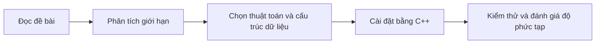

# Thực hành Thuật toán ứng dụng bằng C++

## Giới thiệu

Đây là repository cá nhân dùng để thực hành và hệ thống hóa kiến thức môn **Thuật toán ứng dụng** tại **Đại học Bách khoa Hà Nội (HUST)**. Các bài tập sẽ được cài đặt bằng **C++**, tập trung vào việc hiểu bản chất thuật toán, lựa chọn cấu trúc dữ liệu phù hợp và rèn luyện kỹ năng phân tích độ phức tạp.

Mục tiêu của repository là biến mỗi bài toán thành một cơ hội để:

- phân tích yêu cầu và xây dựng hướng giải;
- áp dụng các thuật toán, cấu trúc dữ liệu thường gặp;
- kiểm thử lời giải với nhiều bộ dữ liệu;
- viết code rõ ràng, hiệu quả và dễ cải thiện.

## Lộ trình thực hành

## Nội dung hiện có

| Chương | Nội dung tiêu biểu |
| --- | --- |
| `chapter1` | `priority_queue`, tư duy tham lam và truy vấn trên dãy số |

Mỗi bài có thể đi kèm đề bài, mã nguồn C++ và ghi chú về ý tưởng hoặc các hàm quan trọng được sử dụng.

## Định hướng

Trong các chương tiếp theo, repository sẽ được mở rộng với nhiều chủ đề hơn như tìm kiếm, sắp xếp, quy hoạch động, đồ thị và các kỹ thuật tối ưu thuật toán. Đây là không gian học tập cá nhân, nơi quá trình hiểu bài và tiến bộ qua từng bài toán được đặt lên hàng đầu.

---

**Ngôn ngữ sử dụng:** C++  
**Mục đích:** Học tập và thực hành thuật toán ứng dụng tại HUST