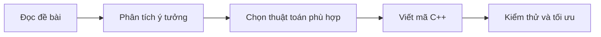

# Thực hành Thuật toán ứng dụng bằng C++


## Giới thiệu

Repository này là nơi lưu trữ các bài tập và lời giải thực hành môn Thuật toán ứng dụng tại Đại học Bách khoa Hà Nội (HUST), được viết bằng C++ và tập trung vào việc rèn luyện tư duy thuật toán, lựa chọn giải pháp tối ưu và hiểu sâu cấu trúc dữ liệu phù hợp với từng bài toán.

Mỗi bài trong repo đều có thể bao gồm:

- đề bài dưới dạng file `.txt`;
- mã nguồn C++ giải quyết bài toán;
- trực quan hóa ý tưởng thuật toán và cấu trúc dữ liệu sử dụng.

## Cấu trúc repository hiện tại

```text
DSA_HUST/
├── README.md
├── chapter1/
│   ├── pairSum.cpp
│   ├── question1/
│   │   ├── question1.cpp
│   │   ├── question1.txt
│   │   └── question1.exe
│   ├── question2/
│   │   ├── question2.txt
│   │   └── Untitled2.cpp
│   ├── question3/
│   │   ├── prefixsum.cpp
│   │   └── prefixsum.txt
│   ├── question4/
│   │   ├── RMQ_Problem.txt
│   │   └── segment_treecpp.cpp
│   ├── question5/
│   │   ├── prefixSum2D.cpp
│   │   └── prefixSum2D.txt
│   └── question6/
│       └── pairSum.txt
```

## Chương 1: Cơ sở và kỹ thuật xử lý dữ liệu cơ bản

### 1) `pairSum.cpp`
- Bài toán: tìm số cặp phần tử có tổng bằng giá trị mục tiêu.
- Kỹ thuật: hai con trỏ / chặn hai đầu.
- Ứng dụng: tối ưu hóa thời gian khi làm việc với mảng đã sắp xếp.

### 2) `question1`
- File: `question1.cpp`, `question1.txt`
- Bài toán: ghép các phần tử tối thiểu bằng cách sử dụng heap / priority queue.
- Kỹ thuật trọng tâm: `priority_queue`, cộng dần các giá trị nhỏ nhất.
- Đây là bài toán tiêu biểu cho tư duy tham lam và tối ưu hóa qua cấu trúc dữ liệu ưu tiên.

### 3) `question2`
- File: `question2.txt`, `Untitled2.cpp`
- Bài toán: truy vấn phần tử tiếp theo lớn hơn một giá trị cho trước.
- Kỹ thuật: xử lý truy vấn hiệu quả, tìm kiếm theo kiểu “next greater element”.

### 4) `question3`
- File: `prefixsum.cpp`, `prefixsum.txt`
- Bài toán: tính tổng đoạn liên tiếp trong dãy số.
- Kỹ thuật: prefix sum.
- Phù hợp cho các truy vấn nhiều lần với dữ liệu lớn.

### 5) `question4`
- File: `segment_treecpp.cpp`, `RMQ_Problem.txt`
- Bài toán: tìm giá trị nhỏ nhất trên đoạn và tổng hợp nhiều truy vấn RMQ.
- Kỹ thuật: segment tree / range minimum query.

### 6) `question5`
- File: `prefixSum2D.cpp`, `prefixSum2D.txt`
- Bài toán: tính tổng trên vùng con trong ma trận 2D.
- Kỹ thuật: prefix sum 2D.
- Dễ dàng mở rộng cho các truy vấn trên bảng dữ liệu lớn.

### 7) `question6`
- File: `pairSum.txt`
- Bài toán: tối ưu tổng chi phí ghép hàng theo nguyên tắc dồn nén liên tục.
- Kỹ thuật: `priority_queue` với hướng tiếp cận tối ưu chi phí.

## Tư duy học tập trong repo

Mỗi bài tập trong repo đều hướng tới một mục tiêu cụ thể:

- hiểu rõ đề bài và ràng buộc đầu vào;
- lựa chọn cấu trúc dữ liệu và thuật toán phù hợp;
- đánh giá độ phức tạp thời gian và bộ nhớ;
- viết code C++ sạch, rõ ràng và hiệu quả;
- tích lũy kinh nghiệm qua bài tập có tính thực hành cao.

## Lộ trình gợi ý



## Mục tiêu hiện tại

- Hoàn thiện các bài tập trong chương 1;
- Nắm vững các kỹ thuật nền tảng như prefix sum, two pointers, segment tree, heap;
- Dùng repo như một nguồn tài liệu học tập cá nhân và đối chiếu giải pháp.

---

Ngôn ngữ chính: C++  
Mục tiêu: thực hành và hệ thống hóa kiến thức thuật toán ứng dụng tại HUST.